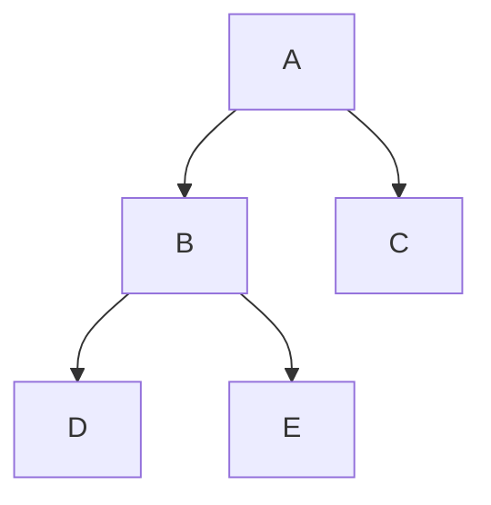
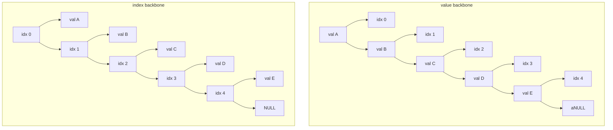
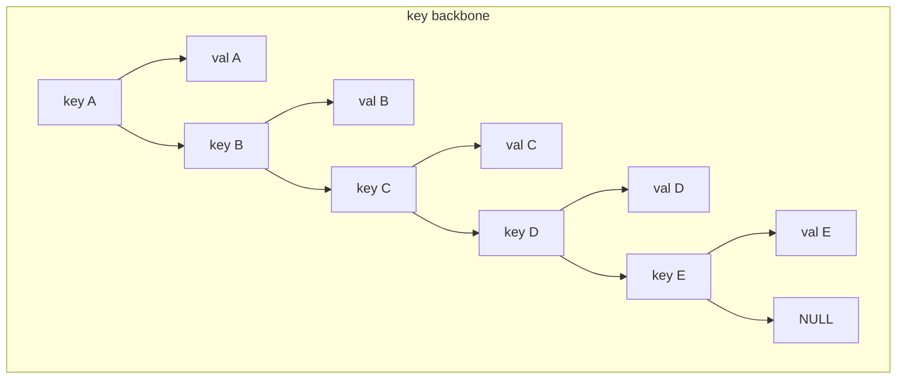

# `CsLorax`

This is a C# implementation of a language inspired by the [Lorax][1] proposal for a tree-based programming language, with some liberties taken.

## Goals

* Use C#.
* Use ANTLR.
* Try to not use Visual Studio.

## Data Types

### Primitives

* Integer: 64-bit signed integer.
* Float: 64-bit floating point.
* String: UTF-8 encoded string. This can be empty.
* Boolean: True or False.
* NULL: The null value, most used for children that don't exist, or for when the value of a tree node is not needed.

### Composites

* Tree Node

A Tree Node is a container for a value and two children: a left child and a right child.
The children can only be Tree Nodes or `NULL`.
All data structures (like arrays, lists, dictionaries, etc) are, and must be, implemented as Tree Nodes.

## Operators

### Standard math operators

* Addition: `+`
* Subtraction: `-`
* Multiplication: `*`
* Division: `/`
* Modulo: `%`
* Negation: `-a`
  
### Standard comparison operators

* Equal: `==`
* Not equal: `!=`
* Greater than: `>`
* Less than: `<`
* Greater than or equal to: `>=`
* Less than or equal to: `<=`

### Tree node operators

These tree node operators are postfix unary operators. Place them after the tree to access.

* Left child: `/`
* Right child: `\`
* Parent: `^`
* Value: `$`

Usage:

```js
var tree = 1[2[3, 4],5];
print(tree$); // prints 1
print(tree/$); // prints 2 (left)
print(tree\$); // prints 5 (right)
print(tree/\$); // prints 4 (left-right child)
print(tree/^$); // prints 1 (left-parent)
print(tree\\$); // NULL (right-right, which doesn't exist)
print(tree\\\$); // NULL (right-right-right, which doesn't exist)
```

## Data Structures as Tree Nodes

### Binary Trees

Binary trees are trivial with the tree nodes.



### Arbitrary N-ary Trees

Arbitary n-ary trees must be implemented as binary trees, using the algorithm to convert N-ary trees to binary trees.

### Lists/Arrays, Stacks, Queues

Lists and arrays can be considered as a tree with only one child per node.
Optionally, the other child can be used to store its index.
Another way is to have the "backbone" be the indexes and the remaining child the value.

The difference between a list and a stack and a queue using this system is what operations are done to the tree.



### Dictionaries

Dictionaries can be implemented similarly to a index-backboned list, with the keys being the backbone.



[1]: [http://www.cs.columbia.edu/~sedwards/classes/2013/w4115-fall/proposals/Lorax.pdf]
[2]: [https://docs.rs/antlr-rust/latest/antlr_rust/]
[3]: [https://github.com/sagiegurari/cargo-make]
